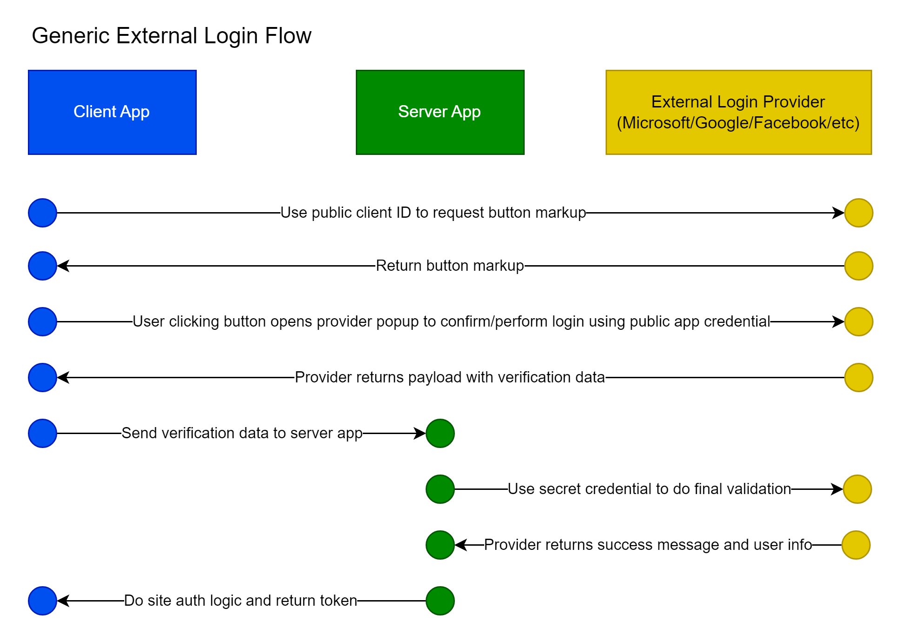

# External Logins



## Code Locations

Application entry point `src/client/index.html` in the `<head>` section ([COOP](https://developer.mozilla.org/en-US/docs/Web/HTTP/Headers/Cross-Origin-Opener-Policy) header required to avoid errors during google auth popup):

```html
<script src="https://accounts.google.com/gsi/client" async defer></script>
<meta http-equiv="Cross-Origin-Opener-Policy" content="same-origin-allow-popups">
```

Button components:

- `src/client/components/auth/GoogleLoginButton.tsx`
- `src/client/components/auth/MicrosoftLoginButton.tsx`

Login page: `src/client/pages/auth/Login.tsx`

- `<GoogleLoginButton />`
- `<MicrosoftLoginButton />`

Sign-up page: `src/client/pages/auth/SignUp.tsx`

- `<GoogleLoginButton />`
- `<MicrosoftLoginButton />`

Environment setting: `.env`

- `GOOGLE_API_CLIENT_ID`
- `GOOGLE_API_SECRET`

Strongly typed environment setting reference: `GlobalSettings.cs`:

- `GOOGLE_API_CLIENT_ID`

Service endpoints: `WebServer/Controllers/AccountController.cs`:

- `LoginGoogle`
- `LoginMicrosoft`
- `MicrosoftLoginRedirect`

## Third Party Library Dependencies

Npm dependencies:

- @azure/msal-browser

Npm dev dependencies:

- @types/gtag.js
- @types/google.accounts
- @types/google-one-tap

Nuget packages:

- Google.Apis.Auth
- Microsoft.AspNetCore.Authentication.Google
- Microsoft.AspNetCore.Authentication.JwtBearer


## Account Setup

These UI's change from time to time so this might not be exactly how to do it, but it should be similar.

### Microsoft Login Account Setup

Azure -> App Registrations

Initial screen asks for display name. Ignore the redirect URIs initially - those will be updated later.

After creation, there should be a "Manage" left nav link - most of the config options are within this submenu.

Important fields:

- Branding and properties -> Publisher domain (follow instructions to verify a new domain if you haven't done through that process yet)
- Authentication
  - Add "Web" by selecting "add a platform" and selecting "Web". The initial UI only gives the option to enter one URL, so enter the first, save, then go back and edit/add the other.
    - Example redirect for local: https://local.drs.mikeyt.net.com:3000/api/account/microsoft-login-redirect-web
    - Example redirect for live: https://drs.mikeyt.net/api/account/microsoft-login-redirect-web
    - Note that you can't add a "front-channel logout URL" that makes sense for multiple environments - you would need to setup separate accounts for each environment in this case
  - Add "Single Page Application" (SPA) by selecting "add a platform" again and selecting "Single-page application" (might be called something slightly different)
    - Example for local: https://local.drs.mikeyt.net:3000/api/account/microsoft-login-redirect
    - Example for live: https://drs.mikeyt.net/api/account/microsoft-login-redirect
  - Supported account types: "Accounts in any organizational directory"
  - "Live SDK support": Yes
  - "Allow public client flows": No
- API Permissions
  - Microsoft Graph User.Read (might be setup by default)

The client_id you need to copy into your client code is also called the "application id" and can be found in the app "overview" section.

Other notes:

- A verified domain is required to get this working in production for all users rather than just test users (see the Branding and properties page -> publisher domain)

### Google Login Account Setup

Google developer console

- Create a project
- Create an OAuth 2.0 credential (left nav, OAuth consent screen -> External user type)
- Add all appropriate javascript origins, including ports for local development. Examples:
  - https://local.drs.mikeyt.net
  - https://local.drs.mikeyt.net:3000
  - https://drs.mikeyt.net
- In OAuth consent screen there is an "edit app" button, be sure to set "Your non-sensitive scopes" to have .../auth/userinfo.email, .../auth/userinfo.profile and openid

Create API credential:

- Left nav, Credentials -> top nav, create credential -> OAuth Client Id
- Application type: Web Application
- Name it something like "MyApp OAuth Credential"
- Add authorized javascript origins, example list:
  - https://local.mydomain.com
  - https://local.mydomain.com:3000
  - https://mydomain.com
- Copy down client id and client secret to secure location
